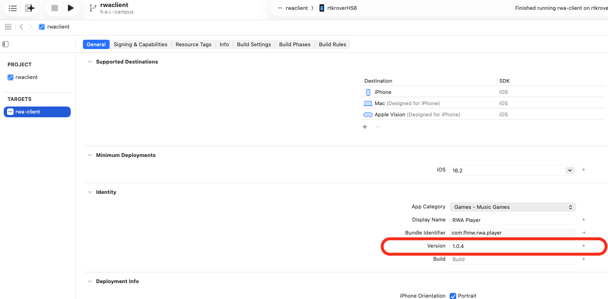

# rwaclient-ios

iOS Client for the RWA Engine

## Building

### Getting the repo

The project pulls in its dependencies (libpd, pure-data, vas_library,
F53OSC, libogg, vorbis, …) as nested git submodules:

```sh
git clone https://github.com/rnd-hsm-klassik/rwa-client.git
cd rwa-client
```

Some (older) submodule pins still reference SSH (`git@github.com:…`) and
legacy `git://` URLs, which fail without an SSH key / are no longer served.
Rewrite them to HTTPS while initializing:

```sh
git -c url."https://github.com/".insteadOf="git@github.com:" \
    -c url."https://".insteadOf="git://" \
    submodule update --init --recursive
```

Notes:

- If a deep pd-extra submodule (e.g. `wiringPi`, hosted on a dead server)
  fails to fetch, it can be ignored — it is not part of the iOS build.
- Existing clones with stale SSH submodule URLs in `.git/config` can be
  repaired with `git submodule sync --recursive`, then re-run the
  `submodule update` above.

### Dev environment setup

Two untracked, gitignored files must be created before the project builds:

1. **`rwaClient/.xcconfig`** — supplies your Apple Development Team ID
   (pulled in via `#include?` from `rwaClient/Config.xcconfig`; the team ID
   is intentionally not committed):

   ```
   DEVELOPMENT_TEAM = YOUR_TEAM_ID
   ```

2. **`rwaClient/src/Telemetry/Telemetry.plist`** — telemetry gateway config.
   Copy the template and fill in the real values (device id, backend URL,
   ingest token — never commit the token):

   ```sh
   cp rwaClient/src/Telemetry/Telemetry.example.plist \
      rwaClient/src/Telemetry/Telemetry.plist
   ```

### Building with Xcode

Open `rwaClient/rwaclient.xcodeproj`, select the **rwaclient** scheme and
build (⌘B). Requires Xcode with the iOS 16.2+ SDK.

### Building from the command line

```sh
xcodebuild -project rwaClient/rwaclient.xcodeproj -scheme rwaclient build
```

Build products land in `rwaClient/build/` (the project sets
`CONFIGURATION_BUILD_DIR = $(SYMROOT)` via `Config.xcconfig`).

### Running in the simulator

From Xcode: select the **rwaclient** scheme, pick an iOS Simulator
destination and run (⌘R).

From the command line:

```sh
xcodebuild -project rwaClient/rwaclient.xcodeproj -scheme rwaclient \
  -destination 'platform=iOS Simulator,name=iPhone 15' build

xcrun simctl boot "iPhone 15"
open -a Simulator
xcrun simctl install "iPhone 15" rwaClient/build/rwaclient.app
xcrun simctl launch "iPhone 15" com.fhnw.rwa.player
```

Note that BLE (rtk-rover connection) is not available in the simulator; the
telemetry pipeline can be exercised with the synthetic source
(`SyntheticSourceEnabled` in `Telemetry.plist`).

## Deploying

### Signing requirements

- Membership in the Apple Developer Program team whose ID is set in
  `rwaClient/.xcconfig` (`DEVELOPMENT_TEAM`).
- The bundle identifier `com.fhnw.rwa.player` registered as an App ID for
  that team, with a matching app record in App Store Connect.
- Signing is **Automatic** ("Apple Development" identity); Xcode creates and
  manages the development and distribution certificates/profiles — you only
  need to be signed in to the team account under Xcode ▸ Settings ▸ Accounts.

### Archiving and uploading to App Store Connect

1. In Xcode, select the **rwaclient** scheme and the **Any iOS Device
   (arm64)** destination (archiving is not available for simulator
   destinations).
2. Bump the build number (`CFBundleVersion`) - App Store Connect rejects
   uploads that reuse a version/build pair.
3. Product ▸ Archive. When the archive completes, the Organizer opens.
4. In the Organizer: **Distribute App ▸ App Store Connect ▸ Upload**, and
   accept the automatic signing defaults. Uploading requires an App Store
   Connect role of App Manager or higher.

### TestFlight guidelines

- After upload, the build appears under the app's **TestFlight** tab in App
  Store Connect once processing finishes (usually a few minutes). Answer the
  export-compliance question to make it testable.
- Use **internal testing** for the team and the kiosk devices: internal
  testers (up to 100 App Store Connect users) get builds immediately, with
  no Beta App Review. External tester groups require a Beta App Review pass.
- Testers install builds through the TestFlight app using the invitation
  sent to their Apple ID email.
- TestFlight builds expire 90 days after upload - plan re-uploads for
  long-running installations accordingly.

## Versioning 

Below are two concise methods to bump the version number.

### Versioning script

Run the following command, replacing `<your_new_version>` with your desired version number:
```bash
./update_version.sh <your_new_version>
```

### Manual method on XCode 

You can also manually update the version number in XCode by navigating to the *rwa-client* target > General > Identity > Version and logging your new version. This will also update all other pertinent versioning entries in the xcode project.


